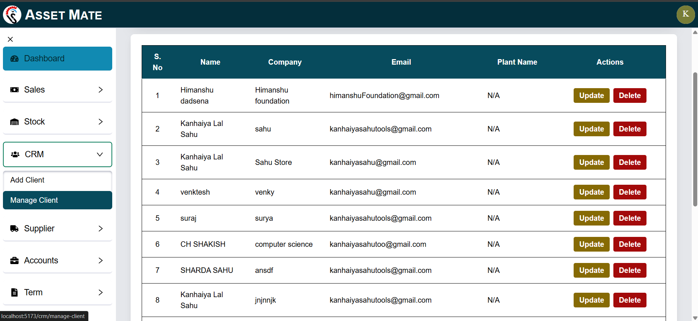
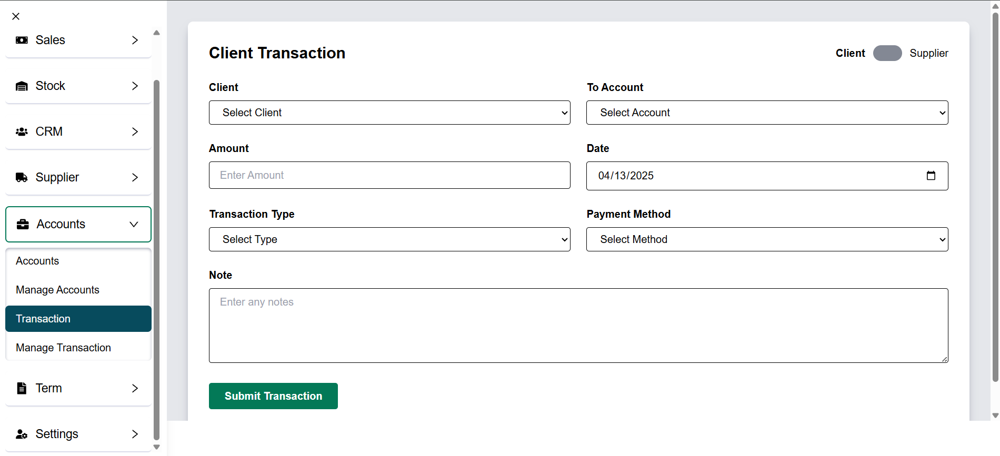

# 🏢 Asset Mate – Inventory & Asset Management System

🚀 **Live Demo:** [Asset Mate](https://assetmate-kanhaiya01.netlify.app/)  

### 🖼️ Some Project Images  







**Asset Mate** is a comprehensive inventory and asset management system designed to streamline business operations through automation. Built with the **MERN stack (MongoDB, Express.js, React, and Node.js)**, Asset Mate is scalable, secure, and easy to use.

---

## 📚 Table of Contents

- [🌐 System Architecture](#-system-architecture)  
- [🎨 Front-end](#-front-end)  
- [🛠️ Back-end](#-back-end)  
- [🧠 Database](#-database)  
- [📡 API Design](#-api-design)  
- [🚀 Deployment](#-deployment)  
- [🧪 Testing](#-testing)  
- [🔮 Future Enhancements](#-future-enhancements)  
- [📦 Installation & Setup](#-installation--setup)  

---

## 🌐 System Architecture

Asset Mate follows a standard **client-server architecture** with the following components:

- **Client (Frontend)** – Built using React + Vite, Tailwind CSS for stylish, fast UI
- **Server (Backend)** – Node.js + Express.js handling all core operations
- **Database** – MongoDB to store users, vendors, assets, orders, and more

### 🖼️ Architecture Diagram  


---

## 🎨 Front-end

The front-end is built using **ReactJS** (with **Vite**) and **Tailwind CSS** for styling, providing a modern interface.

### Key Pages & Features

- **Login & Register Pages** – Secure authentication and authorization
- **Dashboard** – Overview of orders, assets, and user roles
- **Sales Management** – Enquiry, Dispatch, and Quotation
- **Stock Management** – Warehouse, New Product, and Category
- **CRM Management** – Add Client and Manage Client
- **Supplier Management** – New Supplier, Manage Supplier and New order and management
- **Accounts Management** – Accounts and Transactions
- **Terms Management** – Create, Edit, Delete and Update Terms
- **Settings** – User profile settings.

### Front-end Tools

- ReactJS
- Vite
- Tailwind CSS
- Axios (for API calls)
- React Router DOM

---

## 🛠️ Back-end

The backend of the platform is built using **Node.js** and **Express.js**, providing APIs for the front-end to consume. These APIs include functionalities such as user authentication, Sales management, Stock management, and Transaction etc. The back-end also handles the logic for processing and storing items of the inventory.

### Core Features

- **Role-based Authentication** – Admin, Sales, and Warehouse Managers
- **JWT Authentication** – Secure authentication handling
- **Order & Vendor Management** – Full CRUD support
- **Real-time Stock Updates** – Reflects changes in stock instantly
- **Accounts** – Tracks transaction and payments for every order and purchase
- **Terms and Condition** – Allow admin to create terms and conditions
- **Settings** – Handles all the user related functionalities.

### Frameworks, Tools & Libraries

- Node.js: Used as the primary framework for the back-end.
- Express.js: Used as a web application framework, providing a range of features and tools for building web applications.
- MongoDB: Used as the primary database, providing a flexible and scalable data storage solution.
- JWT (JSON Web Tokens): Used for authentication and authorization, providing a secure and reliable way to manage user credentials.
- Bcrypt: Used for password hashing, adding an extra layer of security to user data.
- Mongoose: Used as an Object Data Modeling (ODM) library, providing a way to interact with MongoDB using JavaScript.

---

## 🧠 Database

MongoDB is used to store and manage all application data. Each resource has a dedicated schema ensuring data consistency and performance.

### Data Models

- **User Schema**: To handle the user related data such as name, role, email, password (hashed), and access level etc.
- **Asset/Inventory Schema**: Product ID, name, stock, status, warehouse etc.
- **Vendor Schema**: Vendor name, contact, associated purchase orders etc.
- **Order Schema**: Order ID, items, quantity, status, timestamps etc.
- **Quotation Schema**: For tracking requests and proposals etc.
- **Other Schema**: Products, Terms, Transactions etc.

Mongoose ODM is used to interact with the MongoDB database.

---

## 📡 API Design
The API is designed in RESTful architecture and supports CRUD operations for all entities.

### Key Endpoints

- `POST /api/v1/register` – Register a new user
- `POST /api/v1/login` – Login and get JWT token
- `GET /api/inventory` – Fetch all stock
- `POST /api/inventory` – Add new item
- `PUT /api/inventory/:id` – Update stock info
- `DELETE /api/inventory/:id` – Remove an item
- Similar routes for vendors, orders, quotations, users...

All routes are protected with middleware based on user roles.

---

## 🚀 Deployment

### Front-end

- Hosted on **Netlify**
- Continuous Deployment from GitHub

### Back-end

- Hosted on **Render**
- Uses `.env` file for secure secrets
- MongoDB Atlas for cloud-hosted database

---

---

## 🧪 Testing

Basic testing is performed on both frontend and backend components.

- Manual UI testing (cross-browser/device)
- Postman for backend API testing
- Token-based authentication checks
- Data validation using Mongoose schema validations

---

# 🔮 Future Enhancements

- 📊 Advanced analytics dashboard for asset usage.
- 📱 Mobile-friendly PWA version.
- 🧠 AI-based stock forecast system
- 🔔 Email/SMS notification integration
- 📦 Barcode/QR code support for inventory scanning

---

## 📦 Installation & Setup

```bash
# Clone the repository
git clone https://github.com/Kanhaiyasahu01/Manage-Your-Assets.git
cd Manage-Your-Assets

# Install frontend dependencies
npm install
# Create a .env file in ./ with:
# VITE_BASE_URL=<your url>/api/v1

# Start frontend (in root directory)
npm run dev

# Navigate to backend folder
cd server

# Install backend dependencies
npm install

# Create a .env file in /backend with:
# MONGODB_URI=<your-mongodb-uri>
# PORT=<Port number>
# JWT_SECRET=<your-jwt-secret>

# Start the backend server
npm start
